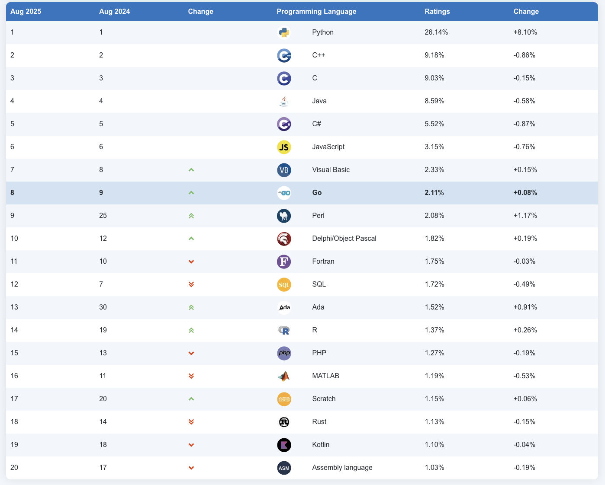
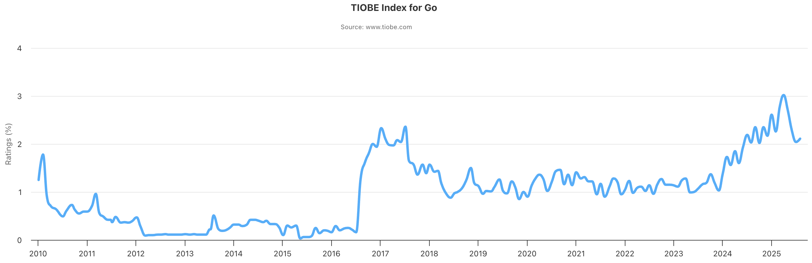
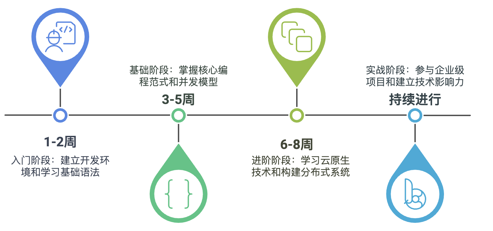
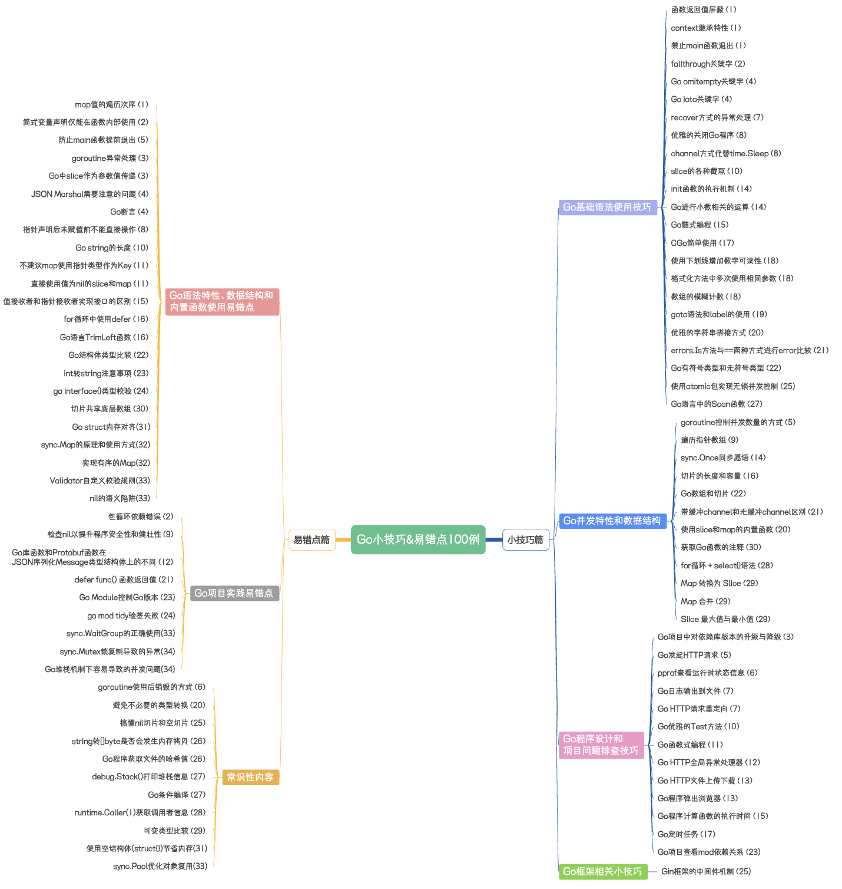

## 《Go小技巧&易错点100例》

**《Go小技巧&易错点100例》** 博客专栏，主要是总结一下自己Coding过程中遇到的问题以及平时读一些博客的所得，因为做Gopher也有了一段时间了，相比Java，有些问题想要利用搜索引擎排查出来可能不是那么的迅速，所以在这里以文章的形式总结出来，也方便各位Gopher们能够顺利的解决所遇到的问题，并能够习得一些小技巧。

#### 专栏目录

| Golang Tips                                               | Go基础知识                                 | Go框架技术                        | Go项目实践                                | Go优化实践                             |
| --------------------------------------------------------- | -------------------------------------- | ----------------------------- | ------------------------------------- | ---------------------------------- |
| `专栏的主要内容，主要是收集和总结Go开发中常见的小技巧和易错点，内容短小精炼，每篇文章大概会提供1~4个知识点` | `Go语言的基础知识，包括语法、原理等等，主要是全篇围绕一个知识点进行讲解` | `Go语言与常见框架的整合使用，提供基本的整合和使用方式` | `一些作者自己的小项目，主要是用Go语言进行开发，按照自己的想法进行实现` | `Go项目中常见的优化实践，包括编码的优化、排查问题工具的使用等等` |
| [专栏大纲](#专栏大纲)                                             | [Go基础知识](#Go基础知识)                      | [Go框架技术](#Go框架技术)             | [Go项目实践](#Go项目实践)                     | [Go优化实践](#Go优化实践)                  |

---

**Go语言最新排名**：[TIOBE](https://www.tiobe.com/tiobe-index/go/)

<!-- 

   

   

 -->

**AI时代Go语言学习路线：**[博客链接](https://mp.weixin.qq.com/s/5x24Nhbxtjkcjv7xuJWPng)

<!-- 

   

 -->

**相关学习资源：**

- [Learning-golang-2024](https://www.bytesizego.com/blog/learning-golang-2024)

### Golang Tips 100

#### 专栏大纲

> **在线地址（更新到第30篇）**：[Go小技巧&易错点100例专栏](https://www.processon.com/view/link/66913a1de7d7970dad42d812)

#### 订阅地址

**CSDN**：[《Go语言小技巧&易错点100例》](https://blog.csdn.net/mr_yanmingxin/category_12232577.html)

**微信公众号**：[Go小技巧&易错点100例](https://mp.weixin.qq.com/mp/appmsgalbum?action=getalbum&album_id=3180454570016030721)

**扫码订阅**：

#### 更新进度

| 标题                                                                                                                                                                                                        | 代码                                                                            | 关键词                                                                                                                                         | 数量  | 难度  |
| --------------------------------------------------------------------------------------------------------------------------------------------------------------------------------------------------------- | ----------------------------------------------------------------------------- | ------------------------------------------------------------------------------------------------------------------------------------------- | --- | --- |
| [开篇词](https://mp.weixin.qq.com/s/p4FEiaaxXn8JDEh0AfaAfA)                                                                                                                                                  | -                                                                             |                                                                                                                                             | 0   | ⭐   |
| [第一篇](https://mp.weixin.qq.com/s/2suBNq6RFN1INarY5pTkpA)                                                                                                                                                  | [code](https://github.com/ibarryyan/golang-tips-100/tree/master/code/code_01) | 1.函数返回值屏蔽 2.context继承特性 3.禁止main函数退出 4.map值的遍历次序函数 `关键词：context、map`                                                        | 4   | ⭐   |
| [第二篇](https://mp.weixin.qq.com/s?__biz=MzIxNDc2ODc3MA==&mid=2247485221&idx=1&sn=35ba81fd1b3d7d029e071c2f40cfb083&chksm=97a3cac8a0d443dee4cf3615017f1ff970ad4a620db0d8a8393bc2df6c228e7361995d72fea4#rd)   | [code](https://github.com/ibarryyan/golang-tips-100/tree/master/code/code_02) | 5.fallthrough关键字 6.简式变量声明仅能在函数内部使用 7.防止main函数提前退出 8.包循环依赖错误fallthrough `关键词：变量声明、函数、包依赖`                                    | 4   | ⭐⭐⭐ |
| [第三篇](https://mp.weixin.qq.com/s?__biz=MzIxNDc2ODc3MA==&mid=2247485371&idx=1&sn=c0d43c4d50cb3fd198c1617742beeaa1&chksm=97a3ca56a0d44340e46742b2378e5c6ebcb32ce2edc0b8266a7356f92989c6cd2d5418e38db4#rd)   | [code](https://github.com/ibarryyan/golang-tips-100/tree/master/code/code_03) | 9.Go项目中对依赖库版本的升级与降级 10.goroutine异常 11.Go中slice作为参数是值传递 `关键词：goroutine、slice`                                                    | 3   | ⭐   |
| [第四篇](https://mp.weixin.qq.com/s/8irznbZxQ1tiDCyzsJJDUQ)                                                                                                                                                  | [code](https://github.com/ibarryyan/golang-tips-100/tree/master/code/code_04) | 12.Go omitempty关键字 13.JSON Marshal需要注意的问题 14.Go iota关键字 `关键词：omitempty、json、iota`                                               | 3   | ⭐   |
| [第五篇](https://mp.weixin.qq.com/s?__biz=MzIxNDc2ODc3MA==&mid=2247485391&idx=1&sn=034608e1cc1351436ff22cb0b5ebc45b&chksm=97a3ca22a0d44334b2b1f82ea81411ff1335b352f7ad35f8179ff3f0a7cf17b2175af007b67f#rd)   | [code](https://github.com/ibarryyan/golang-tips-100/tree/master/code/code_05) | 15.goroutine控制并发数量的方式 16.Go发起HTTP请求 17.断言 `关键词：goroutine、HTTP、断言`                                                               | 3   | ⭐⭐  |
| [第六篇](https://mp.weixin.qq.com/s?__biz=MzIxNDc2ODc3MA==&mid=2247485413&idx=1&sn=c6520ac6911c598f86877c4155185f35&chksm=97a3ca08a0d4431e4d1c0135cc9ee951213222c155847794338f74d5126a6278ac1659f716eb#rd)   | [code](https://github.com/ibarryyan/golang-tips-100/tree/master/code/code_06) | 18.pprof查看运行时状态信息 19.goruntine使用后的销毁 `关键词：pprof、goruntine`                                                                          | 2   | ⭐⭐⭐ |
| [第七篇](https://mp.weixin.qq.com/s?__biz=MzIxNDc2ODc3MA==&mid=2247485446&idx=1&sn=ac2669c690efc4373f81515160269e70&chksm=97a3c5eba0d44cfdfd8238af5682220cfd979b4ae7fae10121ebe53c122a3b8d1abf7385168c#rd)   | [code](https://github.com/ibarryyan/golang-tips-100/tree/master/code/code_07) | 20.Go日志输出到文件 21.recover方式的异常处理 22.Go HTTP请求重定向 `关键词：日志、HTTP、异常处理`                                                               | 3   | ⭐⭐  |
| [第八篇](https://mp.weixin.qq.com/s?__biz=MzIxNDc2ODc3MA==&mid=2247485558&idx=1&sn=b19a67e3a47d7098219d9aacdeb2e6ab&chksm=97a3c59ba0d44c8d51e763d63d1469deab5d5ce511d19b5efaa4a576bce77e5d8326129b371e#rd)   | [code](https://github.com/ibarryyan/golang-tips-100/tree/master/code/code_08) | 23.优雅的关闭Go程序 24.指针声明后未赋值前不能直接操作 25.channel方式代替time.Sleep `关键词：指针、channel`                                                       | 3   | ⭐⭐  |
| [第九篇](https://mp.weixin.qq.com/s?__biz=MzIxNDc2ODc3MA==&mid=2247485574&idx=1&sn=66a307a7b05e9a6784613a1891ecb736&chksm=97a3c56ba0d44c7d747ff0a28cd647f99aee835953b617c48448ba89da3a50a087c1edcea8c8#rd)   | [code](https://github.com/ibarryyan/golang-tips-100/tree/master/code/code_09) | 26.遍历指针数组 [该问题在Go1.22版本已修复] 27.检查nil以提升程序安全性和健壮性 `关键词：指针、数组`                                                                                          | 2   | ⭐   |
| [第十篇](https://mp.weixin.qq.com/s?__biz=MzIxNDc2ODc3MA==&mid=2247485598&idx=1&sn=4eb0ad69d6031aa83a20f8d6d9c1b534&chksm=97a3c573a0d44c656213ba1109dc34e4e4bb1f112055ffd7b048dc89a9454ccfc4bb4059d56b#rd)   | [code](https://github.com/ibarryyan/golang-tips-100/tree/master/code/code_10) | 28.Go string的长度 29.Go优雅的Test方法 30.slice的各种截取 `关键词：string、go Test、slice`                                                         | 3   | ⭐   |
| [第十一篇](https://mp.weixin.qq.com/s?__biz=MzIxNDc2ODc3MA==&mid=2247485631&idx=1&sn=947fcd1308b469ab6a91ebba36e8dfc1&chksm=97a3c552a0d44c44ce63df8a55402c55711e073682b428d209e21fe401a4fe4301f1b79fc9bc#rd)  | [code](https://github.com/ibarryyan/golang-tips-100/tree/master/code/code_11) | 31.Go函数式编程 32.不建议map使用指针类型作为Key 33.直接使用值为nil的slice和map `关键词：函数式编程、map、slice`                                                    | 3   | ⭐⭐  |
| [第十二篇](https://mp.weixin.qq.com/s?__biz=MzIxNDc2ODc3MA==&mid=2247485864&idx=1&sn=ed7b74e37eff86624d38ec018426e6e8&chksm=97a3c445a0d44d532a8863cadc65d3c636974dc9c2eee76692ac189a36e52d5aa64abab68e27#rd)  | [code](https://github.com/ibarryyan/golang-tips-100/tree/master/code/code_12) | 34.Go库函数和Protobuf函数在JSON序列化Message类型结构体上的不同 35.Go HTTP全局异常处理器 `关键词：HTTP、JSON序列化`                                                    | 2   | ⭐   |
| [第十三篇](https://mp.weixin.qq.com/s?__biz=MzIxNDc2ODc3MA==&mid=2247486035&idx=1&sn=fc5570fb9cd3726cbca24330135c3f90&chksm=97a3c7bea0d44ea86884de45f9b08a0d3702d6a3b8f47db80200cdd000b623771233e1a7dda1#rd)  | [code](https://github.com/ibarryyan/golang-tips-100/tree/master/code/code_13) | 36.Go HTTP文件上传下载 37.Go程序弹出浏览器 `关键词：HTTP`                                                                                            | 2   | ⭐   |
| [第十四篇](https://mp.weixin.qq.com/s?__biz=MzIxNDc2ODc3MA==&mid=2247486075&idx=1&sn=47ca00c91c513dfcbfeceb6712c87d6a&chksm=97a3c796a0d44e80c1961cd90572e3c4a8b34db33b3022c873fcee3e73ddc4cdd8682e4b4f0f#rd)  | [code](https://github.com/ibarryyan/golang-tips-100/tree/master/code/code_14) | 38.init()函数的执行机制 39.sync.Once同步原语 40.Go进行保留小数的运算 `关键词：init函数、并发`                                                                | 3   | ⭐⭐⭐ |
| [第十五篇](https://mp.weixin.qq.com/s?__biz=MzIxNDc2ODc3MA==&mid=2247486091&idx=1&sn=d54ef1b75d10e73a7a5d8e6c6462315b&chksm=97a3c766a0d44e708d89b2e98b6c785fddad3f333711eace422f69e97dfda0025ef4420cff8d#rd)  | [code](https://github.com/ibarryyan/golang-tips-100/tree/master/code/code_15) | 41.Go程序跟踪函数的执行时间 42.Go链式编程 43.结构体值接收者和指针接收者实现接口的区别 `关键词：链式编程`                                                                   | 3   | ⭐⭐  |
| [第十六篇](https://mp.weixin.qq.com/s?__biz=MzIxNDc2ODc3MA==&mid=2247486178&idx=1&sn=42542503036027f2d59a8b4d0e0ef81e&chksm=97a3c70fa0d44e19415182b85579717790ddb7880376cb106e038f8c36896371649bc80f7a11#rd)  | [code](https://github.com/ibarryyan/golang-tips-100/tree/master/code/code_16) | 44.切片的长度和容量 45.for循环中使用defer 46.Go语言TrimLeft函数 `关键词：slice、defer`                                                                | 3   | ⭐   |
| [第十七篇](https://mp.weixin.qq.com/s?__biz=MzIxNDc2ODc3MA==&mid=2247486758&idx=1&sn=e430a3f037aa926acfad8037d28434b2&chksm=97a3c0cba0d449dd6bd626a5707f32fe2a3f6e8652ccb2b8db49539389a7208da115c6b51571#rd)  | [code](https://github.com/ibarryyan/golang-tips-100/tree/master/code/code_17) | 47.Go定时任务 48.Cgo简单使用 `关键词：Cgo、定时任务`                                                                                                 | 2   | ⭐⭐  |
| [第十八篇](https://mp.weixin.qq.com/s?__biz=MzIxNDc2ODc3MA==&mid=2247487042&idx=1&sn=4811102b28eae8c8c9c88ac2e86ba97d&chksm=97a3c3afa0d44ab96b57a435a49c473afb867b83d125c4662fe8f808548b0d3cc96eaf6e46eb#rd)  | [code](https://github.com/ibarryyan/golang-tips-100/tree/master/code/code_18) | 49.使用下划线增加数字可读性 50.格式化方法中多次使用相同参数 51.数组的模糊计数 `关键词：fmt`                                                                          | 3   | ⭐   |
| [第十九篇](https://mp.weixin.qq.com/s?__biz=MzIxNDc2ODc3MA==&mid=2247487204&idx=1&sn=7bf189222e5ccb10b89d7da50de10714&chksm=97a3c309a0d44a1fb1212ae0aadbf2288d0bdc475cfa25c9db65e4589b5fc8b208fdf60f0e02#rd)  | [code](https://github.com/ibarryyan/golang-tips-100/tree/master/code/code_19) | 52.goto语法和label的使用 `关键词：goto`                                                                                                           | 1   | ⭐⭐⭐ |
| [第二十篇](https://mp.weixin.qq.com/s/X02cUHcv8MtBfMYWrmuoqw)                                                                                                                                                 | [code](https://github.com/ibarryyan/golang-tips-100/tree/master/code/code_20) | 53.使用slice和map的内置函数 54.避免不必要的类型转换 55.优雅的字符串拼接方式 `关键词：slice、map、类型转换、字符串拼接`                                                      | 3   | ⭐⭐  |
| [第二十一篇](https://mp.weixin.qq.com/s?__biz=MzIxNDc2ODc3MA==&mid=2247487559&idx=1&sn=de4eab08828a71e7d0344b63759eaf21&chksm=97a3ddaaa0d454bcc2088faa1473be59d6d7ce57b9d27659b33f1b454d73cb9e3e4c795e7cad#rd) | [code](https://github.com/ibarryyan/golang-tips-100/tree/master/code/code_21) | 56.errors.Is方法与==两种方式进行error比较 57.带缓冲channel和无缓冲channel区别 58.defer func() 函数返回值 `关键词：defer、channel`                             | 3   | ⭐⭐  |
| [第二十二篇](https://mp.weixin.qq.com/s/aGMyTg7HAstfrG5O9h_xjA)                                                                                                                                                | [code](https://github.com/ibarryyan/golang-tips-100/tree/master/code/code_22) | 59.Go有符号类型和无符号类型 60.Go数组和切片 61.Go结构体类型比较 `关键词：变量类型`                                                                             | 3   | ⭐   |
| [第二十三篇](https://mp.weixin.qq.com/s?__biz=MzIxNDc2ODc3MA==&mid=2247487736&idx=1&sn=b183069cbca46cffcbdcfce7b8cc6565&chksm=97a3dd15a0d454036e9dad64c82e323c3d24d87eb0c57b75b62c862838ca57c615207c053500#rd) | [code](https://github.com/ibarryyan/golang-tips-100/tree/master/code/code_23) | 62.Go Module控制Go版本 63.int转string注意事项 64.Go项目查看mod依赖关系 `关键词：go module`关键词：                                                       | 3   | ⭐⭐  |
| [第二十四篇](https://mp.weixin.qq.com/s/nUefNaAmi6bEAselB9QJmg)                                                                                                                                                | [code](https://github.com/ibarryyan/golang-tips-100/tree/master/code/code_24) | 65.go interface{}类型校验 66.go mod tidy验签失败 `关键词：interface`                                                                            | 3   | ⭐   |
| [第二十五篇](https://mp.weixin.qq.com/s/noB16PTbMmykmQKda43FPA)                                                                                                                                                | [code](https://github.com/ibarryyan/golang-tips-100/tree/master/code/code_25) | 67.使用atomic包实现无锁并发控制 68.Gin框架的中间件机制 69.搞懂nil切片和空切片 `关键词：Gin、slice、并发`                                                            | 2   | ⭐⭐  |
| [第二十六篇](https://mp.weixin.qq.com/s/7rA1nPan70Du3vQlEGrG8g)                                                                                                                                                | [code](https://github.com/ibarryyan/golang-tips-100/tree/master/code/code_26) | 70.string转[]byte是否会发生内存拷贝 71.Go程序获取文件的哈希值 `关键词：string、文件哈希值`                                                                        | 2   | ⭐   |
| [第二十七篇](https://mp.weixin.qq.com/s/59i5_CmzVr19U32t2Ht2_Q)                                                                                                                                                | [code](https://github.com/ibarryyan/golang-tips-100/tree/master/code/code_27) | 72.Go语言中的Scan函数 73.debug.Stack()打印堆栈信息 74.Go条件编译 `关键词：Scan函数、debug.Stack()、条件编译`                                                | 3   | ⭐⭐⭐ |
| [第二十八篇](https://mp.weixin.qq.com/s/9zdsKi44uHXZ0HPSuJW9Ww)                                                                                                                                                | [code](https://github.com/ibarryyan/golang-tips-100/tree/master/code/code_28) | 75.runtime.Caller(1)获取调用者信息 76.for循环 + select{}语法 `关键词：函数调用栈、select{}`                                                              | 2   | ⭐⭐⭐ |
| [第二十九篇](https://mp.weixin.qq.com/s/cgjk4zxBeTLUbgL3n2yJqA)                                                                                                                                                | [code](https://github.com/ibarryyan/golang-tips-100/tree/master/code/code_29) | 77.可变类型比较 78.Slice 最大值与最小值 79.Map 转换为 Slice 80.Map 合并 `关键词：新版内置函数`                                                          | 3   | ⭐⭐  |
| [第三十篇](https://mp.weixin.qq.com/s/gpDDtAd_1lXmCMpXMqgNyw)                                                                                                                                                 | [code](https://github.com/ibarryyan/golang-tips-100/tree/master/code/code_30) | 81.切片共享底层数组 82.获取Go函数的注释 `关键词：抽象语法树、slice`                                                                                          | 2   | ⭐⭐⭐ |
| [第三十一篇](https://mp.weixin.qq.com/s/SaQcPRgtpXOzkCrLZDtF1g)                                                                                                                                                | [code](https://github.com/ibarryyan/golang-tips-100/tree/master/code/code_31) | 83.Go struct内存对齐 84.使用空结构体(struct{})节省内存 `关键词：内存对齐、空struct{}`                                                                       | 2   | ⭐⭐⭐ |
| [第三十二篇](https://mp.weixin.qq.com/s/ntn-m66mOODPUFnq9LRoiQ)                                                                                                                                                | [code](https://github.com/ibarryyan/golang-tips-100/tree/master/code/code_32) | 85.sync.Map的原理和使用方式 86.实现有序的Map `关键词：map`                                                                                           | 2   | ⭐⭐⭐ |
| [第三十三篇](https://mp.weixin.qq.com/s/4pDo0jomeF6GQPOx238EBA)                                                                                                                                                | [code](https://github.com/ibarryyan/golang-tips-100/tree/master/code/code_33) | 87.Validator自定义校验规则 88.sync.Pool优化对象复用 89.sync.WaitGroup的正确使用 90.nil的语义陷阱 `关键词：Validator、sync.Pool、sync.WaitGroup、nil的语义陷阱` | 4   | ⭐⭐⭐ |
| [第三十四篇](https://mp.weixin.qq.com/s/M_DXP-nwvekq-0mxo2G-yA)                                                                                                                                                | [code](https://github.com/ibarryyan/golang-tips-100/tree/master/code/code_34) | 91.sync.Mutex锁复制导致的异常  92.Go堆栈机制下容易导致的并发问题   `关键词：sync.Mutex、锁复制、堆栈、goroutine`                                                      | 2   | ⭐⭐⭐ |
| [第三十五篇](https://mp.weixin.qq.com/s/6RABbLbpgwHq6gRIiI3Xxw)                                                                                                                                                | [code](https://github.com/ibarryyan/golang-tips-100/tree/master/code/code_35) | 93.循环依赖导致栈溢出  94.无法捕获子协程的panic   `关键词：循环依赖、堆栈、goroutine、panic`                                                                      | 2   | ⭐⭐⭐ |
| [第三十六篇](https://mp.weixin.qq.com/s/iDmztgNcQGbBKDRhqN90hA)                                                                                                                                                | [code](https://github.com/ibarryyan/golang-tips-100/tree/master/code/code_36) | 95.使用gops获取正在运行的Go进程  96.将静态文件编译到Go程序中    97.Go语言通过多重赋值实现变量值交换   `关键词：gops工具、变量交换、编译`                                           | 3   | ⭐⭐  |
| [第三十七篇](https://mp.weixin.qq.com/s/EA7wUi65WjUMas75MocpjA)                                                                                                                                                | [code](https://github.com/ibarryyan/golang-tips-100/tree/master/code/code_37) | 98.Go结构体非导出字段不会被序列化  99.Go语言的字符串是不可变    100.代码块{}的作用范围   `关键词：序列化、字符串、代码块`                                                      | 3   | ⭐⭐  |

100+

| 标题                                                         | 代码                                                                            | 关键词                                                                                                                                                                                     | 数量 | 难度  |
|------------------------------------------------------------|-------------------------------------------------------------------------------|-----------------------------------------------------------------------------------------------------------------------------------------------------------------------------------------|----| --- |
| [第三十八篇](https://mp.weixin.qq.com/s/h_wqQn-fbrlAkGEomI_VCA) | [code](https://github.com/ibarryyan/golang-tips-100/tree/master/code/code_38) | 101.new和make的区别  102.Go语言的string和byte   `关键词：make、new、string、byte`                                                                                                              | 2  | ⭐⭐  |
| [第三十九篇](https://mp.weixin.qq.com/s/dMmARoyPQCiZLzqnLHSseA) | [code](https://github.com/ibarryyan/golang-tips-100/tree/master/code/code_39) | 103.context的超时控制是如何实现的？  104.slice不是并发安全的   105.Go语言中的CAS   `关键词：context、slice、cas`                                                                                         | 3  | ⭐⭐⭐  |
| [第四十篇](https://mp.weixin.qq.com/s/lNdgFov23DrG5J-82sE71Q)  | [code](https://github.com/ibarryyan/golang-tips-100/tree/master/code/code_40) | 106.子协程panic的后果与解决方案  107.Go语言中map解决哈希冲突的机制  `关键词：子协程、map`                                                                                                                      | 2  | ⭐⭐  |
| [第四十一篇](https://mp.weixin.qq.com/s/0WiTpXaOkkPNlpMcn3hxFQ) | [code](https://github.com/ibarryyan/golang-tips-100/tree/master/code/code_41) | 108.Go语言的空值  109.flag包使用过程中需要注意的问题  `关键词：空值、flag`                                                                                                                               | 2  | ⭐⭐⭐  |
| [第四十二篇](https://mp.weixin.qq.com/s/Mms6laMLRWGaKgVqshfJoQ) | [code](https://github.com/ibarryyan/golang-tips-100/tree/master/code/code_42) | 110.Go语言进行sha256加密  111.JSON解析时int溢出问题  112.time.After的内存泄漏  `关键词：加密、内存`                                                                                                    | 3  | ⭐⭐⭐  |
| [第四十三篇](https://mp.weixin.qq.com/s/_n5Tgz7KHmixpwyngB7hew) | [code](https://github.com/ibarryyan/golang-tips-100/tree/master/code/code_43) | 113.select和for循环的死锁问题  114.defer改变函数返回值  115.如何优雅地停止 goroutine  `关键词：select、defer、goroutine`                                                                                | 3  | ⭐⭐⭐  |
| [第四十四篇](https://mp.weixin.qq.com/s/xPQT_uXb_piPY3vRZhtidw) | [code](https://github.com/ibarryyan/golang-tips-100/tree/master/code/code_44) | 116.死锁问题：写入缓冲区满了，读取方无法读取  117.错误地不关闭 Channel，导致接收方无法判断何时停止  118.错误地在接收端关闭 Channel，导致 panic  119.读取已关闭的 Channel 时处理不当  120.向已关闭的 Channel 写入数据导致 panic  `关键词：channel` | 5  | ⭐⭐⭐  |
| DOING                                                      |                                                                               |                                                                                                                                                                                         |    |     |

Total：120

#### 同类内容分享

[Go语言100个编程错误小抄](https://colobu.com/2023/07/18/cheatsheet-of-100-go-mistakes/)

[Go语言编程技巧](https://github.com/smallnest/gotips)

[Go语言编程技巧（网页版）](https://colobu.com/gotips/)

[Go优化指南](https://github.com/astavonin/go-optimization-guide)

[Go优化指南（网页版）](https://goperf.dev/)

[Golang Weekly](https://golangweekly.com/)

---

### Go基础知识

| 文章                                                                                                                                                                                                                 | 关键词                   | 难度 |
| ------------------------------------------------------------------------------------------------------------------------------------------------------------------------------------------------------------------ |-----------------------| -- |
| [浅谈Go语言内存模型](https://mp.weixin.qq.com/s?__biz=MzIxNDc2ODc3MA==&mid=2247486736&idx=1&sn=963f0ae34cbd2a10d66670e387654a81&chksm=97a3c0fda0d449eb4b850f60b444150c5d90d4111ad87b8301d89720a7a33f5ef99b915f4057#rd)     | Go内存模型、goroutine      | ⭐⭐ |
| [Go错误处理方式真的不好吗？](https://mp.weixin.qq.com/s?__biz=MzIxNDc2ODc3MA==&mid=2247485136&idx=1&sn=e27084c6d00697ef35e20922e3aaec02&chksm=97a3cb3da0d4422b30bfef8a0f0502e60a1b6f54270d27da7602323bf18798e9ba68db8fd4c2#rd) | 错误处理                  | ⭐⭐ |
| [莫非这就是Go最佳协程池](https://mp.weixin.qq.com/s?__biz=MzIxNDc2ODc3MA==&mid=2247487266&idx=1&sn=fcdf02e4962ff1398a721ef3208a75e9&chksm=97a3c2cfa0d44bd9e9be7e426ef3f029e655e656468515123739849c5137c2d79b9c0dd4838b#rd)   | goroutine、池化思想        | ⭐⭐ |
| [原来go build命令有这么多学问](https://mp.weixin.qq.com/s/GiT6S-TSouTLZVBkftswuQ)                                                                                                                                            | 编译原理                  | ⭐⭐ |
| [Go程序最多能创建多少个协程？](https://mp.weixin.qq.com/s/4c_6R4AEpg-9O_yrG1eyTg)                                                                                                                                               | goroutine的销毁、线程、内存、协程 | ⭐⭐⭐ |
| [搞懂Go泛型，看这一篇就够了](https://mp.weixin.qq.com/s/ASF7WcMstmc_681heK1nfQ)                                                                                                                                                | 泛型                    | ⭐⭐ |
| [搞懂策略模式和模板方法模式](https://mp.weixin.qq.com/s/8P_-KFSJvNtnkNSTx3DgAQ)                                                                                                                                                 | 策略模式、模板方法模式           | ⭐  |
| [浅谈Go语言Optional模式和Builder模式](https://mp.weixin.qq.com/s/dGqaYg1TRhII6jytsfF1Vg)                                                                                                                                    | Optional模式、Builder模式  | ⭐  |
| [函数式编程能有多优雅？](https://mp.weixin.qq.com/s/fj3G8oOBekrxx6CY371oAA)                                                                                                                                                   | 函数式编程                 | ⭐⭐ |
| [为什么说组合优于继承？](https://mp.weixin.qq.com/s/dlR31hpNYX2KjjJ5_lrcug)                                                                                                                                                   | 面向对象                  | ⭐⭐ |
| [浅谈Go语言深拷贝与浅拷贝](https://mp.weixin.qq.com/s/p5Nf3zltKlXA7oFw-2ToaQ)                                                                                                                                                 | 面向对象                  | ⭐⭐ |
| [快来看！你的Go代码还能更优雅](https://mp.weixin.qq.com/s/79B0ez6eGfTwaZWvh0-JcA)                                                                                                                                               | 面向对象                  | ⭐⭐ |
| [Go语言的Fan-In并发模式](https://mp.weixin.qq.com/s/Q55cAsyJkCA7mAJBPtUy8w)                                                                                                                                               | 并发                    | ⭐⭐ |
| [一文搞懂Go语言垃圾回收机制](https://mp.weixin.qq.com/s/ic0i7RhLxYJ53M0e1XJBOw)                                                                                                                                                | 垃圾回收                  | ⭐⭐⭐ |
| [Go内存逃逸分析，真的很神奇吗？](https://mp.weixin.qq.com/s/oG-z1wlDxCOrG6TJPyfm9g)                                                                                                                                              | 内存逃逸                  | ⭐⭐⭐ |
| [Go数据类型，还有哪些你不知道的点？](https://mp.weixin.qq.com/s/c_0PO6MAalPfQsxeFF7m4g)                                                                              | 数据类型                  | ⭐⭐⭐ |
| [Go环境变量那么多，该如何配置？](https://mp.weixin.qq.com/s/_QZhVpYG64Q4V17RDGGc8g)                                                                              | 环境安装                  | ⭐⭐ |
| [Go语言中slice的扩容与并发安全](https://cloud.tencent.com/developer/article/2560838)                                                                              | 切片、并发                  | ⭐⭐⭐ |

---

### Go框架技术

| 文章                                                                                                                                                                                                                   | 关键词          | 难度  |
| -------------------------------------------------------------------------------------------------------------------------------------------------------------------------------------------------------------------- | ------------ | --- |
| [WebSocket原来还能这么玩](https://mp.weixin.qq.com/s?__biz=MzIxNDc2ODc3MA==&mid=2247486120&idx=1&sn=7ae6a6cc6e14e588d76d3f92ef75fe0c&chksm=97a3c745a0d44e53f1c5e286ef9b3b4d8e0480595f5e78b57f30ecc8dad6395573475518671f#rd) | WebSocket    | ⭐⭐  |
| [浅谈一下etcd的Watch机制](https://mp.weixin.qq.com/s/6l6OymkNz_wxBOSsvomiZA)                                                                                                                                                | etcd、Watch机制 | ⭐⭐  |
| [搞懂gRPC支持HTTP进行双协议通信](https://mp.weixin.qq.com/s/eqxw9WliuxwXr2GnGZDKIw)                                                                                                                                             | etcd、Watch机制 | ⭐⭐  |

**Go语言与框架（工具）集成的Demo**

**1）存储类**

| **类别**            | **集成工具**                                                              | **Demo**                                                    | **评分** |
| ----------------- | --------------------------------------------------------------------- | ----------------------------------------------------------- | ------ |
| **MySQL**         | [go-sql-driver/mysql](https://github.com/go-sql-driver/mysql)         | [Demo](https://github.com/go-sql-driver/mysql#usage)        | ⭐⭐⭐⭐⭐  |
| **PostgreSQL**    | [lib/pq](https://github.com/lib/pq)                                   | [Demo](https://github.com/lib/pq#examples)                  | ⭐⭐⭐⭐   |
| **Redis**         | [go-redis/redis](https://github.com/go-redis/redis)                   | [Demo](https://github.com/go-redis/redis#quickstart)        | ⭐⭐⭐⭐⭐  |
| **MongoDB**       | [mongodb/mongo-go-driver](https://github.com/mongodb/mongo-go-driver) | [Demo](https://github.com/mongodb/mongo-go-driver#usage)    | ⭐⭐⭐⭐   |
| **Kafka**         | [segmentio/kafka-go](https://github.com/segmentio/kafka-go)           | [Demo](https://github.com/segmentio/kafka-go#examples)      | ⭐⭐⭐⭐   |
| **Elasticsearch** | [olivere/elastic](https://github.com/olivere/elastic)                 | [Demo](https://github.com/olivere/elastic#examples)         | ⭐⭐⭐⭐   |
| **ORM**           | [go-gorm/gorm](https://github.com/go-gorm/gorm)                       | [Demo](https://github.com/go-gorm/gorm#quick-start)         | ⭐⭐⭐⭐⭐  |
| **文件存储**          | [minio/minio-go](https://github.com/minio/minio-go)                   | [Demo](https://github.com/minio/minio-go#quick-start)       | ⭐⭐⭐⭐   |
| **缓存**            | [patrickmn/go-cache](https://github.com/patrickmn/go-cache)           | [Demo](https://github.com/patrickmn/go-cache#example-usage) | ⭐⭐⭐⭐   |
| **分布式锁**          | [go-redsync/redsync](https://github.com/go-redsync/redsync)           | [Demo](https://github.com/go-redsync/redsync#usage)         | ⭐⭐⭐⭐   |
| **对象存储**          | [aws/aws-sdk-go](https://github.com/aws/aws-sdk-go)                   | [Demo](https://github.com/aws/aws-sdk-go#usage)             | ⭐⭐⭐⭐⭐  |
| **加密与安全**         | [golang/crypto](https://github.com/golang/crypto)                     | [Demo](https://github.com/golang/crypto#examples)           | ⭐⭐⭐⭐⭐  |

**2）Web与RPC框架**

| **类别**        | **集成工具**                                                  | **Demo**                                                           | **评分** |
| ------------- | --------------------------------------------------------- | ------------------------------------------------------------------ | ------ |
| **gRPC**      | [grpc/grpc-go](https://github.com/grpc/grpc-go)           | [Demo](https://github.com/grpc/grpc-go#examples)                   | ⭐⭐⭐⭐⭐  |
| **Gin框架**     | [gin-gonic/gin](https://github.com/gin-gonic/gin)         | [Demo](https://github.com/gin-gonic/gin#quick-start)               | ⭐⭐⭐⭐⭐  |
| **WebSocket** | [gorilla/websocket](https://github.com/gorilla/websocket) | [Demo](https://github.com/gorilla/websocket#examples)              | ⭐⭐⭐⭐   |
| **HTTP客户端**   | [go-resty/resty](https://github.com/go-resty/resty)       | [Demo](https://github.com/go-resty/resty#usage)                    | ⭐⭐⭐⭐⭐  |
| **API文档生成**   | [swaggo/swag](https://github.com/swaggo/swag)             | [Demo](https://github.com/swaggo/swag#declarative-comments-format) | ⭐⭐⭐⭐⭐  |
| **HTTP路由**    | [gorilla/mux](https://github.com/gorilla/mux)             | [Demo](https://github.com/gorilla/mux#examples)                    | ⭐⭐⭐⭐⭐  |

**3）消息类**

| **类别**      | **集成工具**                                                    | **Demo**                                               | **评分** |
| ----------- | ----------------------------------------------------------- | ------------------------------------------------------ | ------ |
| **Kafka**   | [segmentio/kafka-go](https://github.com/segmentio/kafka-go) | [Demo](https://github.com/segmentio/kafka-go#examples) | ⭐⭐⭐⭐   |
| **Logging** | [sirupsen/logrus](https://github.com/sirupsen/logrus)       | [Demo](https://github.com/sirupsen/logrus#example)     | ⭐⭐⭐⭐⭐  |
| **消息队列**    | [nsqio/go-nsq](https://github.com/nsqio/go-nsq)             | [Demo](https://github.com/nsqio/go-nsq#usage)          | ⭐⭐⭐⭐   |

**4）其他**

| **类别**            | **集成工具**                                                                    | **Demo**                                                                 | **评分** |
| ----------------- | --------------------------------------------------------------------------- | ------------------------------------------------------------------------ | ------ |
| **Elasticsearch** | [olivere/elastic](https://github.com/olivere/elastic)                       | [Demo](https://github.com/olivere/elastic#examples)                      | ⭐⭐⭐⭐   |
| **Prometheus**    | [prometheus/client_golang](https://github.com/prometheus/client_golang)     | [Demo](https://github.com/prometheus/client_golang#instrumenting-a-code) | ⭐⭐⭐⭐⭐  |
| **配置管理**          | [spf13/viper](https://github.com/spf13/viper)                               | [Demo](https://github.com/spf13/viper#putting-values-into-viper)         | ⭐⭐⭐⭐⭐  |
| **任务调度**          | [robfig/cron](https://github.com/robfig/cron)                               | [Demo](https://github.com/robfig/cron#example)                           | ⭐⭐⭐⭐   |
| **CI/CD**         | [go-cmd/cmd](https://github.com/go-cmd/cmd)                                 | [Demo](https://github.com/go-cmd/cmd#examples)                           | ⭐⭐⭐⭐   |
| **分布式锁**          | [go-redsync/redsync](https://github.com/go-redsync/redsync)                 | [Demo](https://github.com/go-redsync/redsync#usage)                      | ⭐⭐⭐⭐   |
| **命令行工具**         | [spf13/cobra](https://github.com/spf13/cobra)                               | [Demo](https://github.com/spf13/cobra#usage)                             | ⭐⭐⭐⭐⭐  |
| **分布式追踪**         | [opentracing/opentracing-go](https://github.com/opentracing/opentracing-go) | [Demo](https://github.com/opentracing/opentracing-go#tracing-a-function) | ⭐⭐⭐⭐   |
| **并发控制**          | [panjf2000/ants](https://github.com/panjf2000/ants)                         | [Demo](https://github.com/panjf2000/ants#quick-start)                    | ⭐⭐⭐⭐   |
| **国际化**           | [nicksnyder/go-i18n](https://github.com/nicksnyder/go-i18n)                 | [Demo](https://github.com/nicksnyder/go-i18n#usage)                      | ⭐⭐⭐⭐   |
| **机器学习**          | [gorgonia/gorgonia](https://github.com/gorgonia/gorgonia)                   | [Demo](https://github.com/gorgonia/gorgonia#quick-start)                 | ⭐⭐⭐⭐   |
| **区块链**           | [ethereum/go-ethereum](https://github.com/ethereum/go-ethereum)             | [Demo](https://github.com/ethereum/go-ethereum#quick-start)              | ⭐⭐⭐⭐   |

---

### Go优化实践

| 文章                                                                                                                                                                                                                   | 关键词   | 难度  |
| -------------------------------------------------------------------------------------------------------------------------------------------------------------------------------------------------------------------- | ----- | --- |
| [Go程序出问题了？有pprof！](https://mp.weixin.qq.com/s?__biz=MzIxNDc2ODc3MA==&mid=2247486824&idx=1&sn=b536c61525ad422592eee9d57796aef6&chksm=97a3c085a0d4499309e0d6d85ca4c562cf1a98cf114bb5330470fdc2b86d7dbccebb1d56ac3c#rd) | pprof | ⭐⭐⭐ |
| [听说它可以让代码更优雅](https://mp.weixin.qq.com/s?__biz=MzIxNDc2ODc3MA==&mid=2247487332&idx=1&sn=e6bbe038d919af24dea28b6c19a250b6&chksm=97a3c289a0d44b9fb3f7b4353e320e33e8226c13953582ffda5cf2226cdb96efc74ccce51cae#rd)      | 静态检查  | ⭐⭐  |

---

### Go项目实践

| 项目                                                 | 技术点        | 难度  |
| -------------------------------------------------- | ---------- | --- |
| [Go二维码小游戏](project/qrcode-go.md)                   | 二维码生成      | ⭐⭐  |
| [文件传输工具](project/ftransferor.md)                   | TCP、哈希计算   | ⭐⭐  |
| [SDK Demo](project/http-sdk.md)                    | SDK设计、HTTP | ⭐   |
| [Beego RequestId 中间件](project/beego-request-id.md) | Beego      | ⭐   |
| [Github OAuth Demo](project/oauth-demo.md)         | OAuth2.0   | ⭐   |
| [protobuf-msg-reader](project/protobuf-msg-reader.md)         | JavaScript  | ⭐   |

---

### 技术专栏

- [《玩转gRPC框架》](https://blog.csdn.net/mr_yanmingxin/category_12172887.html)

---

### 关注公众号获取最新更新

有问题或建议可以提交[issue](https://github.com/ibarryyan/golang-tips-100/issues/new)，也可以微信公众号进行留言

---

### 请作者喝杯咖啡

---

### 致谢

感谢[JetBrains](https://www.jetbrains.com)提供的IDE支持
