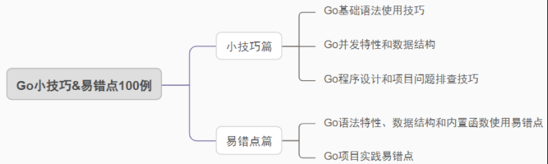

## 《Go小技巧&易错点100例》专栏代码

Hello，欢迎各位提交issue~

#### 专栏大纲

#### 更新进度

| 标题                                                         | 发表时间        | 相关代码 |
| ------------------------------------------------------------ | --------------- | -------- |
| [《Go小技巧&易错点100例》开篇词](https://mp.weixin.qq.com/s/p4FEiaaxXn8JDEh0AfaAfA) | 2023-11-05 周日 | -        |
| [《Go小技巧&易错点100例》第一篇](https://mp.weixin.qq.com/s/2suBNq6RFN1INarY5pTkpA)                           |  2023-11-11 周六               |  [code](https://github.com/ibarryyan/golang-tips-100/tree/master/code/code_01) |
| [《Go小技巧&易错点100例》第二篇](https://mp.weixin.qq.com/s?__biz=MzIxNDc2ODc3MA==&mid=2247485221&idx=1&sn=35ba81fd1b3d7d029e071c2f40cfb083&chksm=97a3cac8a0d443dee4cf3615017f1ff970ad4a620db0d8a8393bc2df6c228e7361995d72fea4#rd))                           |  2023-11-18 周六               |  [code](https://github.com/ibarryyan/golang-tips-100/tree/master/code/code_02) |
| [《Go小技巧&易错点100例》第三篇]([https://mp.weixin.qq.com/s/2suBNq6RFN1INarY5pTkpA](https://mp.weixin.qq.com/s?__biz=MzIxNDc2ODc3MA==&mid=2247485371&idx=1&sn=c0d43c4d50cb3fd198c1617742beeaa1&chksm=97a3ca56a0d44340e46742b2378e5c6ebcb32ce2edc0b8266a7356f92989c6cd2d5418e38db4#rd)https://mp.weixin.qq.com/s?__biz=MzIxNDc2ODc3MA==&mid=2247485371&idx=1&sn=c0d43c4d50cb3fd198c1617742beeaa1&chksm=97a3ca56a0d44340e46742b2378e5c6ebcb32ce2edc0b8266a7356f92989c6cd2d5418e38db4#rd)                           |  2023-11-25 周六               |  [code](https://github.com/ibarryyan/golang-tips-100/tree/master/code/code_03) |
| DOING |                 |          |

