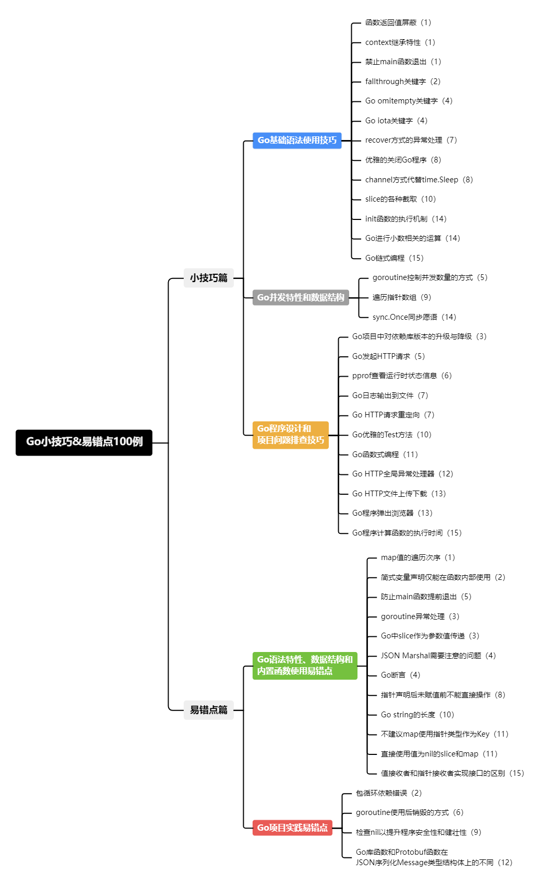

## 《Go小技巧&易错点100例》专栏代码

#### 简介

《Go小技巧&易错点100例》博客专栏，主要是总结一下自己Coding过程中遇到的问题以及平时读一些博客的所得，因为做gopher也有了一段时间了，相比Java，有些问题想要利用搜索引擎排查出来可能不是那么的迅速，所以在这里以文章的形式总结出来，也方便各位gopher们能够顺利的解决所遇到的问题，并能够习得一些小技巧。

#### 专栏大纲

#### 关注公众号获取最新更新

#### 更新进度

| 标题                                                         | 发表时间        | 相关代码 |
| ------------------------------------------------------------ | --------------- | -------- |
| [《Go小技巧&易错点100例》开篇词](https://mp.weixin.qq.com/s/p4FEiaaxXn8JDEh0AfaAfA) | 2023-11-05 周日 | -        |
| [《Go小技巧&易错点100例》第一篇](https://mp.weixin.qq.com/s/2suBNq6RFN1INarY5pTkpA)                           |  2023-11-11 周六               |  [code](https://github.com/ibarryyan/golang-tips-100/tree/master/code/code_01) |
| [《Go小技巧&易错点100例》第二篇](https://mp.weixin.qq.com/s?__biz=MzIxNDc2ODc3MA==&mid=2247485221&idx=1&sn=35ba81fd1b3d7d029e071c2f40cfb083&chksm=97a3cac8a0d443dee4cf3615017f1ff970ad4a620db0d8a8393bc2df6c228e7361995d72fea4#rd)                           |  2023-11-18 周六               |  [code](https://github.com/ibarryyan/golang-tips-100/tree/master/code/code_02) |
| [《Go小技巧&易错点100例》第三篇](https://mp.weixin.qq.com/s?__biz=MzIxNDc2ODc3MA==&mid=2247485371&idx=1&sn=c0d43c4d50cb3fd198c1617742beeaa1&chksm=97a3ca56a0d44340e46742b2378e5c6ebcb32ce2edc0b8266a7356f92989c6cd2d5418e38db4#rd)                           |  2023-11-25 周六               |  [code](https://github.com/ibarryyan/golang-tips-100/tree/master/code/code_03) |
| [《Go小技巧&易错点100例》第四篇](https://mp.weixin.qq.com/s/8irznbZxQ1tiDCyzsJJDUQ) | 2023-12-2 周六 | [code](https://github.com/ibarryyan/golang-tips-100/tree/master/code/code_04) |
| [《Go小技巧&易错点100例》第五篇](https://mp.weixin.qq.com/s?__biz=MzIxNDc2ODc3MA==&mid=2247485391&idx=1&sn=034608e1cc1351436ff22cb0b5ebc45b&chksm=97a3ca22a0d44334b2b1f82ea81411ff1335b352f7ad35f8179ff3f0a7cf17b2175af007b67f#rd) | 2023-12-9 周六  | [code](https://github.com/ibarryyan/golang-tips-100/tree/master/code/code_05) |
| [《Go小技巧&易错点100例》第六篇](https://mp.weixin.qq.com/s?__biz=MzIxNDc2ODc3MA==&mid=2247485413&idx=1&sn=c6520ac6911c598f86877c4155185f35&chksm=97a3ca08a0d4431e4d1c0135cc9ee951213222c155847794338f74d5126a6278ac1659f716eb#rd) | 2023-12-16 周六  | [code](https://github.com/ibarryyan/golang-tips-100/tree/master/code/code_06) |
| [《Go小技巧&易错点100例》第七篇](https://mp.weixin.qq.com/s?__biz=MzIxNDc2ODc3MA==&mid=2247485446&idx=1&sn=ac2669c690efc4373f81515160269e70&chksm=97a3c5eba0d44cfdfd8238af5682220cfd979b4ae7fae10121ebe53c122a3b8d1abf7385168c#rd) | 2023-12-23 周六 | [code](https://github.com/ibarryyan/golang-tips-100/tree/master/code/code_07) |
| [《Go小技巧&易错点100例》第八篇](https://mp.weixin.qq.com/s?__biz=MzIxNDc2ODc3MA==&mid=2247485558&idx=1&sn=b19a67e3a47d7098219d9aacdeb2e6ab&chksm=97a3c59ba0d44c8d51e763d63d1469deab5d5ce511d19b5efaa4a576bce77e5d8326129b371e#rd) | 2023-12-30 周六 | [code](https://github.com/ibarryyan/golang-tips-100/tree/master/code/code_08) |
| [《Go小技巧&易错点100例》第九篇](https://mp.weixin.qq.com/s?__biz=MzIxNDc2ODc3MA==&mid=2247485574&idx=1&sn=66a307a7b05e9a6784613a1891ecb736&chksm=97a3c56ba0d44c7d747ff0a28cd647f99aee835953b617c48448ba89da3a50a087c1edcea8c8#rd) | 2024-1-6 周六 | [code](https://github.com/ibarryyan/golang-tips-100/tree/master/code/code_09) |
| [《Go小技巧&易错点100例》第十篇](https://mp.weixin.qq.com/s?__biz=MzIxNDc2ODc3MA==&mid=2247485598&idx=1&sn=4eb0ad69d6031aa83a20f8d6d9c1b534&chksm=97a3c573a0d44c656213ba1109dc34e4e4bb1f112055ffd7b048dc89a9454ccfc4bb4059d56b#rd) | 2024-1-13 周六 | [code](https://github.com/ibarryyan/golang-tips-100/tree/master/code/code_10) |
| [《Go小技巧&易错点100例》第十一篇](https://mp.weixin.qq.com/s?__biz=MzIxNDc2ODc3MA==&mid=2247485631&idx=1&sn=947fcd1308b469ab6a91ebba36e8dfc1&chksm=97a3c552a0d44c44ce63df8a55402c55711e073682b428d209e21fe401a4fe4301f1b79fc9bc#rd) | 2024-2-24 周六 | [code](https://github.com/ibarryyan/golang-tips-100/tree/master/code/code_11) |
| [《Go小技巧&易错点100例》第十二篇](https://mp.weixin.qq.com/s?__biz=MzIxNDc2ODc3MA==&mid=2247485864&idx=1&sn=ed7b74e37eff86624d38ec018426e6e8&chksm=97a3c445a0d44d532a8863cadc65d3c636974dc9c2eee76692ac189a36e52d5aa64abab68e27#rd) | 2024-3-2 周六 | [code](https://github.com/ibarryyan/golang-tips-100/tree/master/code/code_12) |
| [《Go小技巧&易错点100例》第十三篇](https://mp.weixin.qq.com/s?__biz=MzIxNDc2ODc3MA==&mid=2247486035&idx=1&sn=fc5570fb9cd3726cbca24330135c3f90&chksm=97a3c7bea0d44ea86884de45f9b08a0d3702d6a3b8f47db80200cdd000b623771233e1a7dda1#rd) | 2024-4-1 周一 | [code](https://github.com/ibarryyan/golang-tips-100/tree/master/code/code_13) |
| [《Go小技巧&易错点100例》第十四篇](https://mp.weixin.qq.com/s?__biz=MzIxNDc2ODc3MA==&mid=2247486075&idx=1&sn=47ca00c91c513dfcbfeceb6712c87d6a&chksm=97a3c796a0d44e80c1961cd90572e3c4a8b34db33b3022c873fcee3e73ddc4cdd8682e4b4f0f#rd) | 2024-4-11 周四 | [code](https://github.com/ibarryyan/golang-tips-100/tree/master/code/code_14) |
| [《Go小技巧&易错点100例》第十五篇](https://mp.weixin.qq.com/s?__biz=MzIxNDc2ODc3MA==&mid=2247486091&idx=1&sn=d54ef1b75d10e73a7a5d8e6c6462315b&chksm=97a3c766a0d44e708d89b2e98b6c785fddad3f333711eace422f69e97dfda0025ef4420cff8d#rd) | 2024-4-14 周日 | [code](https://github.com/ibarryyan/golang-tips-100/tree/master/code/code_15) |
| [《Go小技巧&易错点100例》第十六篇](https://mp.weixin.qq.com/s?__biz=MzIxNDc2ODc3MA==&mid=2247486178&idx=1&sn=42542503036027f2d59a8b4d0e0ef81e&chksm=97a3c70fa0d44e19415182b85579717790ddb7880376cb106e038f8c36896371649bc80f7a11#rd) | 2024-4-27 周日 | [code](https://github.com/ibarryyan/golang-tips-100/tree/master/code/code_16) |
| [《Go小技巧&易错点100例》第十七篇](https://mp.weixin.qq.com/s?__biz=MzIxNDc2ODc3MA==&mid=2247486758&idx=1&sn=e430a3f037aa926acfad8037d28434b2&chksm=97a3c0cba0d449dd6bd626a5707f32fe2a3f6e8652ccb2b8db49539389a7208da115c6b51571#rd) | 2024-5-19 周六 | [code](https://github.com/ibarryyan/golang-tips-100/tree/master/code/code_17) |
| DOING | | |

#### 其他Go语言相关博客

#### 捐赠

