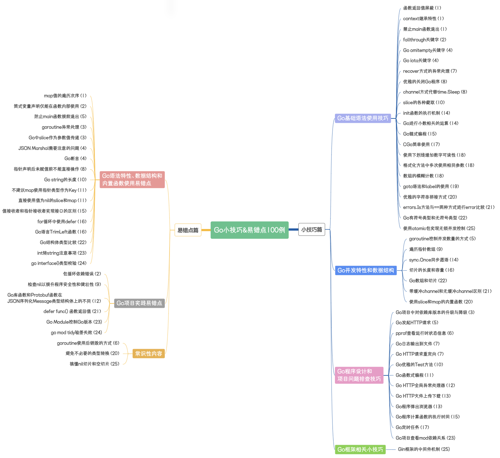

## 《Go小技巧&易错点100例》

#### 简介

《Go小技巧&易错点100例》博客专栏，主要是总结一下自己Coding过程中遇到的问题以及平时读一些博客的所得，因为做gopher也有了一段时间了，相比Java，有些问题想要利用搜索引擎排查出来可能不是那么的迅速，所以在这里以文章的形式总结出来，也方便各位gopher们能够顺利的解决所遇到的问题，并能够习得一些小技巧。

#### 目录

[Golang Tips 100]()

[Go基础知识]()

[Go框架技术]()

[Go工具使用]()

[Go项目实践]()

[Go与各种三方工具集成]()

---

### Golang Tips 100

#### 专栏大纲（后面的括号内的数字为所在文章的序号）

> **在线地址**：https://www.processon.com/view/link/66913a1de7d7970dad42d812
> 
> 图片已更新到第25篇

#### 更新进度

| 标题                                                                                                                                                                                                        | 代码                                                                            | 关键词                       | 难度  |
| --------------------------------------------------------------------------------------------------------------------------------------------------------------------------------------------------------- | ----------------------------------------------------------------------------- | ------------------------- | --- |
| [开篇词](https://mp.weixin.qq.com/s/p4FEiaaxXn8JDEh0AfaAfA)                                                                                                                                                  | -                                                                             |                           | ⭐   |
| [第一篇](https://mp.weixin.qq.com/s/2suBNq6RFN1INarY5pTkpA)                                                                                                                                                  | [code](https://github.com/ibarryyan/golang-tips-100/tree/master/code/code_01) | 函数、context、map            | ⭐   |
| [第二篇](https://mp.weixin.qq.com/s?__biz=MzIxNDc2ODc3MA==&mid=2247485221&idx=1&sn=35ba81fd1b3d7d029e071c2f40cfb083&chksm=97a3cac8a0d443dee4cf3615017f1ff970ad4a620db0d8a8393bc2df6c228e7361995d72fea4#rd)   | [code](https://github.com/ibarryyan/golang-tips-100/tree/master/code/code_02) | fallthrough、变量声明、函数、包依赖   | ⭐⭐⭐ |
| [第三篇](https://mp.weixin.qq.com/s?__biz=MzIxNDc2ODc3MA==&mid=2247485371&idx=1&sn=c0d43c4d50cb3fd198c1617742beeaa1&chksm=97a3ca56a0d44340e46742b2378e5c6ebcb32ce2edc0b8266a7356f92989c6cd2d5418e38db4#rd)   | [code](https://github.com/ibarryyan/golang-tips-100/tree/master/code/code_03) | goroutine、slice           | ⭐   |
| [第四篇](https://mp.weixin.qq.com/s/8irznbZxQ1tiDCyzsJJDUQ)                                                                                                                                                  | [code](https://github.com/ibarryyan/golang-tips-100/tree/master/code/code_04) | omitempty、json、iota       | ⭐   |
| [第五篇](https://mp.weixin.qq.com/s?__biz=MzIxNDc2ODc3MA==&mid=2247485391&idx=1&sn=034608e1cc1351436ff22cb0b5ebc45b&chksm=97a3ca22a0d44334b2b1f82ea81411ff1335b352f7ad35f8179ff3f0a7cf17b2175af007b67f#rd)   | [code](https://github.com/ibarryyan/golang-tips-100/tree/master/code/code_05) | goroutine、HTTP、断言         | ⭐⭐  |
| [第六篇](https://mp.weixin.qq.com/s?__biz=MzIxNDc2ODc3MA==&mid=2247485413&idx=1&sn=c6520ac6911c598f86877c4155185f35&chksm=97a3ca08a0d4431e4d1c0135cc9ee951213222c155847794338f74d5126a6278ac1659f716eb#rd)   | [code](https://github.com/ibarryyan/golang-tips-100/tree/master/code/code_06) | pprof、goruntine           | ⭐⭐⭐ |
| [第七篇](https://mp.weixin.qq.com/s?__biz=MzIxNDc2ODc3MA==&mid=2247485446&idx=1&sn=ac2669c690efc4373f81515160269e70&chksm=97a3c5eba0d44cfdfd8238af5682220cfd979b4ae7fae10121ebe53c122a3b8d1abf7385168c#rd)   | [code](https://github.com/ibarryyan/golang-tips-100/tree/master/code/code_07) | 日志、HTTP、异常处理              | ⭐⭐  |
| [第八篇](https://mp.weixin.qq.com/s?__biz=MzIxNDc2ODc3MA==&mid=2247485558&idx=1&sn=b19a67e3a47d7098219d9aacdeb2e6ab&chksm=97a3c59ba0d44c8d51e763d63d1469deab5d5ce511d19b5efaa4a576bce77e5d8326129b371e#rd)   | [code](https://github.com/ibarryyan/golang-tips-100/tree/master/code/code_08) | 指针、channel                | ⭐⭐  |
| [第九篇](https://mp.weixin.qq.com/s?__biz=MzIxNDc2ODc3MA==&mid=2247485574&idx=1&sn=66a307a7b05e9a6784613a1891ecb736&chksm=97a3c56ba0d44c7d747ff0a28cd647f99aee835953b617c48448ba89da3a50a087c1edcea8c8#rd)   | [code](https://github.com/ibarryyan/golang-tips-100/tree/master/code/code_09) | 指针、数组                     | ⭐   |
| [第十篇](https://mp.weixin.qq.com/s?__biz=MzIxNDc2ODc3MA==&mid=2247485598&idx=1&sn=4eb0ad69d6031aa83a20f8d6d9c1b534&chksm=97a3c573a0d44c656213ba1109dc34e4e4bb1f112055ffd7b048dc89a9454ccfc4bb4059d56b#rd)   | [code](https://github.com/ibarryyan/golang-tips-100/tree/master/code/code_10) | string、go Test、slice      | ⭐   |
| [第十一篇](https://mp.weixin.qq.com/s?__biz=MzIxNDc2ODc3MA==&mid=2247485631&idx=1&sn=947fcd1308b469ab6a91ebba36e8dfc1&chksm=97a3c552a0d44c44ce63df8a55402c55711e073682b428d209e21fe401a4fe4301f1b79fc9bc#rd)  | [code](https://github.com/ibarryyan/golang-tips-100/tree/master/code/code_11) | 函数式编程、map、slice           | ⭐⭐  |
| [第十二篇](https://mp.weixin.qq.com/s?__biz=MzIxNDc2ODc3MA==&mid=2247485864&idx=1&sn=ed7b74e37eff86624d38ec018426e6e8&chksm=97a3c445a0d44d532a8863cadc65d3c636974dc9c2eee76692ac189a36e52d5aa64abab68e27#rd)  | [code](https://github.com/ibarryyan/golang-tips-100/tree/master/code/code_12) | HTTP、JSON序列化              | ⭐   |
| [第十三篇](https://mp.weixin.qq.com/s?__biz=MzIxNDc2ODc3MA==&mid=2247486035&idx=1&sn=fc5570fb9cd3726cbca24330135c3f90&chksm=97a3c7bea0d44ea86884de45f9b08a0d3702d6a3b8f47db80200cdd000b623771233e1a7dda1#rd)  | [code](https://github.com/ibarryyan/golang-tips-100/tree/master/code/code_13) | HTTP                      | ⭐   |
| [第十四篇](https://mp.weixin.qq.com/s?__biz=MzIxNDc2ODc3MA==&mid=2247486075&idx=1&sn=47ca00c91c513dfcbfeceb6712c87d6a&chksm=97a3c796a0d44e80c1961cd90572e3c4a8b34db33b3022c873fcee3e73ddc4cdd8682e4b4f0f#rd)  | [code](https://github.com/ibarryyan/golang-tips-100/tree/master/code/code_14) | init函数、并发                 | ⭐⭐⭐ |
| [第十五篇](https://mp.weixin.qq.com/s?__biz=MzIxNDc2ODc3MA==&mid=2247486091&idx=1&sn=d54ef1b75d10e73a7a5d8e6c6462315b&chksm=97a3c766a0d44e708d89b2e98b6c785fddad3f333711eace422f69e97dfda0025ef4420cff8d#rd)  | [code](https://github.com/ibarryyan/golang-tips-100/tree/master/code/code_15) | 链式编程                      | ⭐⭐  |
| [第十六篇](https://mp.weixin.qq.com/s?__biz=MzIxNDc2ODc3MA==&mid=2247486178&idx=1&sn=42542503036027f2d59a8b4d0e0ef81e&chksm=97a3c70fa0d44e19415182b85579717790ddb7880376cb106e038f8c36896371649bc80f7a11#rd)  | [code](https://github.com/ibarryyan/golang-tips-100/tree/master/code/code_16) | slice、defer               | ⭐   |
| [第十七篇](https://mp.weixin.qq.com/s?__biz=MzIxNDc2ODc3MA==&mid=2247486758&idx=1&sn=e430a3f037aa926acfad8037d28434b2&chksm=97a3c0cba0d449dd6bd626a5707f32fe2a3f6e8652ccb2b8db49539389a7208da115c6b51571#rd)  | [code](https://github.com/ibarryyan/golang-tips-100/tree/master/code/code_17) | Cgo、定时任务                  | ⭐⭐  |
| [第十八篇](https://mp.weixin.qq.com/s?__biz=MzIxNDc2ODc3MA==&mid=2247487042&idx=1&sn=4811102b28eae8c8c9c88ac2e86ba97d&chksm=97a3c3afa0d44ab96b57a435a49c473afb867b83d125c4662fe8f808548b0d3cc96eaf6e46eb#rd)  | [code](https://github.com/ibarryyan/golang-tips-100/tree/master/code/code_18) | fmt                       | ⭐   |
| [第十九篇](https://mp.weixin.qq.com/s?__biz=MzIxNDc2ODc3MA==&mid=2247487204&idx=1&sn=7bf189222e5ccb10b89d7da50de10714&chksm=97a3c309a0d44a1fb1212ae0aadbf2288d0bdc475cfa25c9db65e4589b5fc8b208fdf60f0e02#rd)  | [code](https://github.com/ibarryyan/golang-tips-100/tree/master/code/code_19) | goto                      | ⭐⭐⭐ |
| [第二十篇](https://mp.weixin.qq.com/s/X02cUHcv8MtBfMYWrmuoqw)                                                                                                                                                 | [code](https://github.com/ibarryyan/golang-tips-100/tree/master/code/code_20) | slice、map、类型转换、字符串拼接      | ⭐⭐  |
| [第二十一篇](https://mp.weixin.qq.com/s?__biz=MzIxNDc2ODc3MA==&mid=2247487559&idx=1&sn=de4eab08828a71e7d0344b63759eaf21&chksm=97a3ddaaa0d454bcc2088faa1473be59d6d7ce57b9d27659b33f1b454d73cb9e3e4c795e7cad#rd) | [code](https://github.com/ibarryyan/golang-tips-100/tree/master/code/code_21) | defer、channel             | ⭐⭐  |
| [第二十二篇](https://mp.weixin.qq.com/s/aGMyTg7HAstfrG5O9h_xjA)                                                                                                                                                | [code](https://github.com/ibarryyan/golang-tips-100/tree/master/code/code_22) | 变量类型                      | ⭐   |
| [第二十三篇](https://mp.weixin.qq.com/s?__biz=MzIxNDc2ODc3MA==&mid=2247487736&idx=1&sn=b183069cbca46cffcbdcfce7b8cc6565&chksm=97a3dd15a0d454036e9dad64c82e323c3d24d87eb0c57b75b62c862838ca57c615207c053500#rd) | [code](https://github.com/ibarryyan/golang-tips-100/tree/master/code/code_23) | go module                 | ⭐⭐  |
| [第二十四篇](https://mp.weixin.qq.com/s/nUefNaAmi6bEAselB9QJmg)                                                                                                                                                | [code](https://github.com/ibarryyan/golang-tips-100/tree/master/code/code_24) | interface                 | ⭐   |
| [第二十五篇](https://mp.weixin.qq.com/s/noB16PTbMmykmQKda43FPA)                                                                                                                                                | [code](https://github.com/ibarryyan/golang-tips-100/tree/master/code/code_25) | Gin、slice、并发              | ⭐⭐  |
| [第二十六篇](https://mp.weixin.qq.com/s/7rA1nPan70Du3vQlEGrG8g)                                                                                                                                                | [code](https://github.com/ibarryyan/golang-tips-100/tree/master/code/code_26) | string、文件哈希值              | ⭐   |
| [第二十七篇](https://mp.weixin.qq.com/s/59i5_CmzVr19U32t2Ht2_Q)                                                                                                                                                | [code](https://github.com/ibarryyan/golang-tips-100/tree/master/code/code_27) | Scan函数、debug.Stack()、条件编译 | ⭐⭐⭐ |
| [第二十八篇](https://mp.weixin.qq.com/s/9zdsKi44uHXZ0HPSuJW9Ww)                                                                                                                                                | [code](https://github.com/ibarryyan/golang-tips-100/tree/master/code/code_27) | 函数调用栈、`select{}`          | ⭐⭐⭐ |
| DOING                                                                                                                                                                                                     |                                                                               |                           |     |

---

### Go基础知识

| 文章                                                                                                                                                                                                                 | 关键词                   | 难度  |
| ------------------------------------------------------------------------------------------------------------------------------------------------------------------------------------------------------------------ | --------------------- | --- |
| [浅谈Go语言内存模型](https://mp.weixin.qq.com/s?__biz=MzIxNDc2ODc3MA==&mid=2247486736&idx=1&sn=963f0ae34cbd2a10d66670e387654a81&chksm=97a3c0fda0d449eb4b850f60b444150c5d90d4111ad87b8301d89720a7a33f5ef99b915f4057#rd)     | Go内存模型、goroutine      | ⭐⭐  |
| [Go错误处理方式真的不好吗？](https://mp.weixin.qq.com/s?__biz=MzIxNDc2ODc3MA==&mid=2247485136&idx=1&sn=e27084c6d00697ef35e20922e3aaec02&chksm=97a3cb3da0d4422b30bfef8a0f0502e60a1b6f54270d27da7602323bf18798e9ba68db8fd4c2#rd) | 错误处理                  | ⭐⭐  |
| [莫非这就是Go最佳协程池](https://mp.weixin.qq.com/s?__biz=MzIxNDc2ODc3MA==&mid=2247487266&idx=1&sn=fcdf02e4962ff1398a721ef3208a75e9&chksm=97a3c2cfa0d44bd9e9be7e426ef3f029e655e656468515123739849c5137c2d79b9c0dd4838b#rd)   | goroutine、池化思想        | ⭐⭐  |
| [原来go build命令有这么多学问](https://mp.weixin.qq.com/s/GiT6S-TSouTLZVBkftswuQ)                                                                                                                                            | 编译原理                  | ⭐⭐  |
| [Go程序最多能创建多少个协程？](https://mp.weixin.qq.com/s/4c_6R4AEpg-9O_yrG1eyTg)                                                                                                                                               | goroutine的销毁、线程、内存、协程 | ⭐⭐⭐ |
| [搞懂Go泛型，看这一篇就够了](https://mp.weixin.qq.com/s/ASF7WcMstmc_681heK1nfQ)                                                                                                                                                | 泛型                    | ⭐⭐  |
| [搞懂策略模式和模板方法模式](https://mp.weixin.qq.com/s/8P_-KFSJvNtnkNSTx3DgAQ)                                                                                                                                                 | 策略模式、模板方法模式           | ⭐   |
| [浅谈Go语言Optional模式和Builder模式](https://mp.weixin.qq.com/s/dGqaYg1TRhII6jytsfF1Vg)                                                                                                                                    | Optional模式、Builder模式  | ⭐   |
| [函数式编程能有多优雅？](https://mp.weixin.qq.com/s/fj3G8oOBekrxx6CY371oAA)                                                                                                                                                   | 函数式编程                 | ⭐⭐  |
| [为什么说组合优于继承？](https://mp.weixin.qq.com/s/dlR31hpNYX2KjjJ5_lrcug)                                                                                                                                                   | 面向对象                  | ⭐⭐  |
| [浅谈Go语言深拷贝与浅拷贝](https://mp.weixin.qq.com/s/p5Nf3zltKlXA7oFw-2ToaQ)                                                                                                                                                 | 面向对象                  | ⭐⭐  |

---

### Go框架技术

| 文章                                                                                                                                                                                                                   | 关键词          | 难度  |
| -------------------------------------------------------------------------------------------------------------------------------------------------------------------------------------------------------------------- | ------------ | --- |
| [WebSocket原来还能这么玩](https://mp.weixin.qq.com/s?__biz=MzIxNDc2ODc3MA==&mid=2247486120&idx=1&sn=7ae6a6cc6e14e588d76d3f92ef75fe0c&chksm=97a3c745a0d44e53f1c5e286ef9b3b4d8e0480595f5e78b57f30ecc8dad6395573475518671f#rd) | WebSocket    | ⭐⭐  |
| [浅谈一下etcd的Watch机制](https://mp.weixin.qq.com/s/6l6OymkNz_wxBOSsvomiZA)                                                                                                                                                | etcd、Watch机制 | ⭐⭐  |

---

### Go工具使用

| 文章                                                                                                                                                                                                                   | 关键词   | 难度  |
| -------------------------------------------------------------------------------------------------------------------------------------------------------------------------------------------------------------------- | ----- | --- |
| [Go程序出问题了？有pprof！](https://mp.weixin.qq.com/s?__biz=MzIxNDc2ODc3MA==&mid=2247486824&idx=1&sn=b536c61525ad422592eee9d57796aef6&chksm=97a3c085a0d4499309e0d6d85ca4c562cf1a98cf114bb5330470fdc2b86d7dbccebb1d56ac3c#rd) | pprof | ⭐⭐⭐ |
| [听说它可以让代码更优雅](https://mp.weixin.qq.com/s?__biz=MzIxNDc2ODc3MA==&mid=2247487332&idx=1&sn=e6bbe038d919af24dea28b6c19a250b6&chksm=97a3c289a0d44b9fb3f7b4353e320e33e8226c13953582ffda5cf2226cdb96efc74ccce51cae#rd)      | 静态检查  | ⭐⭐  |

---

### Go项目实践

| 项目                                                 | 技术点        | 难度  |
| -------------------------------------------------- | ---------- | --- |
| [Go二维码小游戏](project/qrcode-go.md)                   | 二维码生成      | ⭐⭐  |
| [文件传输工具](project/ftransferor.md)                   | TCP、哈希计算   | ⭐⭐  |
| [SDK Demo](project/http-sdk.md)                    | SDK设计、HTTP | ⭐   |
| [Beego RequestId 中间件](project/beego-request-id.md) | Beego      | ⭐   |
| [Github OAuth Demo](project/oauth-demo.md)         | OAuth2.0   | ⭐   |

---

### Go与各种三方工具集成

TODO

| 类别    | 集成工具 | Demo | 评分  |
| ----- | ---- | ---- | --- |
| DB    |      |      |     |
| MQ    |      |      |     |
| Cache |      |      |     |
|       |      |      |     |

---

### 关注公众号获取最新更新

---

### 请作者喝杯咖啡

### 致谢

感谢[JetBrains](https://www.jetbrains.com)提供的IDE支持
